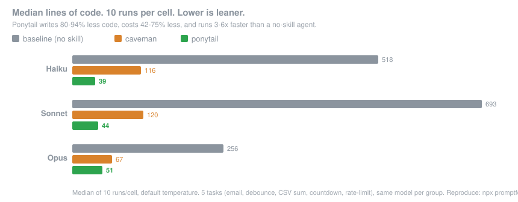

<p align="center">
  <picture>
    <source media="(prefers-color-scheme: dark)" srcset="assets/logo-dark.png">
    
  </picture>
</p>

<h1 align="center">NWBZPWNR — a Ponytail fork</h1>

<p align="center">
  <em>He says nothing. He writes one line. It works.</em>
</p>

<p align="center">
  
  
  
  
</p>

<p align="center">
  <strong>80-94% less code &middot; 3-6&times; faster &middot; 42-75% cheaper</strong><br>
  <sub>Per-task code, latency, and cost on the Claude API, not your plan's quota. Median across Haiku, Sonnet, and Opus (10 runs for code and latency, 30 for the re-verified cost). Results vary by model and prompt: the ruleset re-injects each turn, so on a short prompt or a terse reasoning model that overhead can outweigh the savings. <a href="benchmarks/">Reproduce it yourself.</a></sub>
</p>

---

> **NWBZPWNR** — a fork of [ponytail](https://github.com/DietrichGebert/ponytail). Same lazy senior dev, plus extra skills (`ponytail-skill`, `ponytail-claude-md`, `ponytail-critique`) and a 15-skill context-engineering pack.

You know him. Long ponytail. Oval glasses. Has been at the company longer than the version control. You show him fifty lines; he looks at them, says nothing, and replaces them with one.

Ponytail puts him inside your AI agent.

## Before / after

You ask for a date picker. Your agent installs flatpickr, writes a wrapper component, adds a stylesheet, and starts a discussion about timezones.

With ponytail:

```html
<!-- ponytail: browser has one -->
<input type="date">
```

More survivors in [examples/](examples/).

## Numbers

Five everyday tasks (email validator, debounce, CSV sum, countdown timer, rate limiter), three models, three arms: no skill, the [caveman](https://github.com/JuliusBrussee/caveman) skill, and ponytail. Ten runs per cell, median reported.

<p align="center">
  
</p>

**80-94% less code, 42-75% less cost, and 3-6× faster than a no-skill agent, on every Claude model.** Every shortcut ponytail takes is marked in the code with a `ponytail:` comment naming its upgrade path. Reproduce it yourself: `npx promptfoo eval -c benchmarks/promptfooconfig.yaml`. Method and raw numbers: [benchmarks/](benchmarks/). Production-grade tasks, where an unconstrained agent bloats far more, are written up in [benchmarks/results/](benchmarks/results/).

**That is the byproduct, not the pitch.** These are Claude numbers, and they vary by model. Capable instruction-following models follow the ladder and write far less, cheaper and faster. Terse reasoning models can go the other way: the ladder is a deliberation step, so the model spends thinking tokens working through the rungs before it saves any output, and together with the always-on ruleset that can cost more than the shorter code saves. On GPT-5.5 it does. And all of this is single-shot, one prompt in and one answer out: a real agent session re-injects the ruleset and runs the ladder every turn, which this benchmark does not measure, so per-session cost can land either way. The rule was never "fewest tokens." It is: write only what the task needs, and never cut validation, error handling, security, or accessibility. The code ends up small because it is necessary, not golfed, and that is the part that stays maintainable. Lower cost and latency are a side effect on the models that follow it.

## How it works

Before writing code, the agent stops at the first rung that holds:

```
1. Does this need to exist?   → no: skip it (YAGNI)
2. Stdlib does it?            → use it
3. Native platform feature?   → use it
4. Installed dependency?      → use it
5. One line?                  → one line
6. Only then: the minimum that works
```

Lazy, not negligent: trust-boundary validation, data-loss handling, security, and accessibility are never on the chopping block.

## Install

The most effort ponytail will ever ask of you:

The Claude Code and Codex plugins run two tiny Node.js lifecycle hooks, so `node` needs to be on your PATH (note for Nix/nvm users: it must be on the non-interactive shell's PATH). If it isn't, the skills still work, the always-on activation just stays quiet instead of erroring on every prompt.

### Claude Code

```
/plugin marketplace add DietrichGebert/ponytail
/plugin install ponytail@ponytail
```

### Codex

```bash
codex plugin marketplace add DietrichGebert/ponytail
codex
```

Open `/plugins`, select the Ponytail marketplace, and install Ponytail. Then
open `/hooks`, review and trust its two lifecycle hooks, and start a new thread.

This same install also covers the Codex desktop app: restart the app after installing and it picks up the plugin.

### GitHub Copilot CLI

```bash
copilot plugin marketplace add DietrichGebert/ponytail
copilot plugin install ponytail@ponytail
```

In an interactive Copilot CLI session, use the slash equivalents:

```
/plugin marketplace add DietrichGebert/ponytail
/plugin install ponytail@ponytail
```

Copilot CLI namespaces plugin commands by plugin name. For example:

```text
/ponytail:ponytail ultra
/ponytail:ponytail-review
```

### Pi agent harness

```
pi install git:github.com/DietrichGebert/ponytail
```

### OpenCode

Run OpenCode from a checkout of this repo (the plugin reuses its `hooks/` and `skills/`), and add to `opencode.json`:

```json
{ "plugin": ["./.opencode/plugins/ponytail.mjs"] }
```

Injects the ruleset every turn at the active level; adds the `/ponytail` commands (see [Commands](#commands)). OpenCode also auto-loads this repo's `AGENTS.md`, so the rules hold even without the plugin. The plugin adds the `lite/full/ultra/off` levels.

The `./` path resolves against your project's `opencode.json`; to share one checkout across projects, point it at the absolute path of the `.mjs` instead (it finds its `hooks/` and `skills/` relative to its own file).

### Gemini CLI

```bash
gemini extensions install https://github.com/DietrichGebert/ponytail
```

Loads the ruleset as always-on context every session and registers the `/ponytail` commands; the `skills/` ship too, activated when a task needs them.

### Antigravity CLI

Google is renaming Gemini CLI to Antigravity CLI (the `agy` binary); the same extension installs there:

```bash
agy plugin install https://github.com/DietrichGebert/ponytail
```

It reuses this repo's `gemini-extension.json`. One difference: Antigravity converts the `/ponytail` commands into skills, so you type them into the chat (e.g. `/ponytail-review` as a message) instead of picking them from a slash menu. To run it as an always-on rule instead, drop the ruleset into `.agents/rules/`.

### OpenClaw

```bash
clawhub install ponytail
```

Installs ponytail as an OpenClaw skill from ClawHub; the review, audit, debt, and help skills install the same way (`clawhub install ponytail-review`, and so on). OpenClaw applies it on coding tasks and also exposes it as a `/ponytail` command. Without ClawHub, copy [`.openclaw/skills/ponytail`](.openclaw/skills/) into `~/.openclaw/skills/`.

That was it. He'd be proud. He won't say it.

Active every session, with a handful of commands (see [Commands](#commands)). `/ponytail ultra` exists for when the codebase has wronged you personally. Startup and mode-change text shows the current mode.

This fork adds three more. `/ponytail-skill` writes a new skill the lazy way — runs the ladder first and tells you when the skill shouldn't exist at all. `/ponytail-claude-md` updates CLAUDE.md without bloating it: every line is a per-session token tax, so it adds only what overrides a default and routes the rest elsewhere. `/ponytail-critique` audits a plan *before* you build it — keep / cut / shrink / defer verdicts on whether each piece is worth the code, the forward gate to `/ponytail-review`'s backward one.

### Context-engineering skills

Context engineering is ponytail for tokens: context is a finite attention budget, not storage — load what earns its place, cut the rest. This fork ports the [agent-skills-for-context-engineering](https://github.com/muratcankoylan/agent-skills-for-context-engineering) collection (MIT) into the ponytail house style — single-file, terse, tables over prose, lazy-with-tokens framing, no scripts. Fifteen skills:

| Skill | What |
|---|---|
| `/context-fundamentals` | Finite attention budget, U-shaped curve, position-aware placement — the conceptual anchor. |
| `/context-optimization` | Token tactics: KV-cache → mask → compact → partition, at measured thresholds. |
| `/context-compression` | Summarize long sessions by tokens-per-task; probe survival, not text overlap. |
| `/context-degradation` | Five named failure modes (lost-in-middle, poisoning, distraction, confusion, clash) + detection. |
| `/filesystem-context` | File-backed overflow: scratch pads, plans, sub-agent coordination, grep/glob over semantic search. |
| `/memory-systems` | Cross-session memory; start filesystem, climb only on retrieval decay; invalidate, don't discard. |
| `/tool-design` | Tool descriptions agents route on; consolidate to one purpose each; primitives over wrappers. |
| `/multi-agent-patterns` | Topologies to partition context; the telephone-game cliff and the `forward_message` fix. |
| `/evaluation` | Outcome-not-path rubrics, stratified test sets, deterministic gate before the judge. |
| `/advanced-evaluation` | LLM-as-judge: position-swap protocol, bias taxonomy, calibration. |
| `/harness-engineering` | Control surfaces: locked rubrics, append-only logs, novelty gates, rollback. |
| `/hosted-agents` | Hosted-agent infra: warm pools, image registries, snapshots, keystroke pre-warm. |
| `/project-development` | Task-model fit, manual-prototype-first, the acquire→render pipeline, cost estimation. |
| `/latent-briefing` | KV-cache state sharing between agents (only when you control worker inference runtime). |
| `/bdi-mental-states` | Formal belief/desire/intention ontology — RDF/SPARQL agent reasoning (niche). |

In Codex, invoke the skills as `@ponytail`, `@ponytail-review`, and
`@ponytail-help`. Startup and mode-change text shows the current mode.

Set the level for every new session with the `PONYTAIL_DEFAULT_MODE` env var (`lite`/`full`/`ultra`/`off`), or a `defaultMode` field in `~/.config/ponytail/config.json` (`%APPDATA%\ponytail\config.json` on Windows). The default is `full`.

Cursor, Windsurf, Cline, GitHub Copilot (editor), Aider, Kiro: copy the matching rules file from this repo ([`.cursor/rules/`](.cursor/rules/), [`.windsurf/rules/`](.windsurf/rules/), [`.clinerules/`](.clinerules/), [`.github/copilot-instructions.md`](.github/copilot-instructions.md), [`AGENTS.md`](AGENTS.md), [`.kiro/steering/`](.kiro/steering/)).

Kiro: copy `.kiro/steering/ponytail.md` to `~/.kiro/steering/` (global) or `.kiro/steering/` in your project.

GitHub Copilot CLI fallback (instruction-only mode): it reads `AGENTS.md` and `.github/copilot-instructions.md` in a project, or copy the rules into `~/.copilot/copilot-instructions.md` to run ponytail in every project. This path keeps always-on guidance, but does not add plugin mode switches or hooks.

VS Code with the Codex extension reads `AGENTS.md`, which this repo ships, so it works from the repo root with no setup (`~/.codex/AGENTS.md` makes Codex global).

Which files map to which agent: [Agent portability](docs/agent-portability.md).

## Commands

| Command | What it does |
|---------|--------------|
| `/ponytail [lite \| full \| ultra \| off]` | Set the intensity, or turn it off. No argument reports the current level. |
| `/ponytail-review` | Review the current diff for over-engineering, hands back a delete-list. |
| `/ponytail-audit` | Audit the whole repo for over-engineering, not just the diff. |
| `/ponytail-debt` | Harvest the `ponytail:` shortcuts you've deferred into a ledger, so "later" doesn't become "never". |
| `/ponytail-help` | Quick reference for the commands above. |
| `/ponytail-skill` | Write a new skill only when the ladder says a skill should exist. |
| `/ponytail-claude-md` | Update CLAUDE.md without turning it into a per-session token tax. |
| `/ponytail-critique` | Audit a plan before implementation: keep, cut, shrink, or defer. |

Commands need a skill-capable host (Claude Code, Codex, OpenCode, Gemini, pi). In Codex they're skills, invoke with `@` (`@ponytail-review`). The instruction-only adapters (Cursor, Windsurf, Cline, Copilot, Kiro, Antigravity) load the always-on ruleset without the commands.

## Development

When changing the compact rule text, keep the agent copies aligned:

```bash
node scripts/check-rule-copies.js
npm test
```

The OpenClaw skill package (`.openclaw/skills/`) is generated from `skills/`; rerun `node scripts/build-openclaw-skills.js` after changing a skill, the test suite fails if it is stale.

The correctness benchmark spawns Python for email and CSV checks; `python3` is tried before `python`. CSV checks need `pandas` installed locally.

## FAQ

**Does it need a config file?**
No. An optional `~/.config/ponytail/config.json` or `PONYTAIL_DEFAULT_MODE` env var can set the default level, but nothing is required.

**What if I really need the 120-line cache class?**
You don't. Insist anyway and he'll build it. Slowly. Correctly. While looking at you.

**Does it scale?**
The code you never wrote scales infinitely. Zero bugs, zero CVEs, 100% uptime since forever.

**Why "ponytail"?**
You know exactly why.

## License

[MIT](LICENSE). The shortest license that works.
